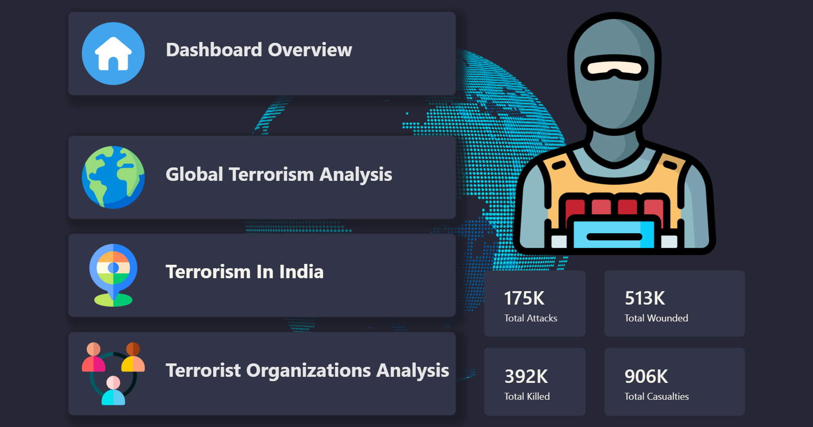

# 🌍 Global Terrorism Analysis Dashboard (Power BI)

---

## 🔎 Project Overview

This project presents an interactive **Power BI dashboard** built using the **Global Terrorism Database (GTD)** to analyze worldwide terrorism incidents.  
It uncovers meaningful patterns and trends across **years, regions, countries, attack types, terrorist organizations, and casualties**, enabling data-driven insights through rich and interactive visualizations.

The dashboard supports dynamic exploration using slicers, maps, KPIs, and drill-through analysis.

---

## 🚀 Live Dashboard

🔗 **View Interactive Power BI Dashboard:**  
https://app.powerbi.com/links/nd67FYSFmX?ctid=e14e73eb-5251-4388-8d67-8f9f2e2d5a46&pbi_source=linkShare

---

## 🧩 Key Features

- 🌍 Interactive geospatial analysis using **Azure Maps**
- 🖼️ Dynamic terrorist organization logos using **GitHub RAW image URLs**
- 📊 KPI cards displaying **Total Attacks, Fatalities, and Wounded**
- 📈 Year-wise trend analysis of terrorist activities
- 🎛️ Page navigation using **buttons and bookmarks**
- 🔍 Advanced slicers for region, year, country, attack type, and organization
- 🔎 Drill-through pages for detailed analysis

---

## 🛠️ Tools & Technologies

- Microsoft Power BI Desktop  
- Power BI Service  
- Power Query (ETL & Data Cleaning)  
- DAX (Calculated Measures & KPIs)  
- Azure Maps (Geospatial Visualization)  
- CSV Datasets  
- GitHub (Image Hosting & Version Control)

---

## 📂 Repository Structure

Global-Terrorism-Analysis/  
├── Images/                         # Dashboard screenshots  
├── Ocr-Input/                      # OCR input files  
├── Ocr-Output/                     # OCR extracted output  
│  
├── CountryFlags.csv                # Country–flag mapping  
├── Map-File.json                   # Custom map configuration  
├── Ocr-Extract.py                  # OCR extraction script  
├── README.md                       # Project documentation  
├── Terror.pbix                     # Cleaned Power BI dashboard  
├── UncleanedTerror.pbix            # Raw / uncleaned dashboard  
├── TerrorCSV.zip                   # Terrorism incidents dataset  
└── TerroristOrganizationCSV.zip    # Organization dataset  

---

## 📸 Dashboard Screenshots

### 🖥️ Overview Page

  

<i>High-level summary of global terrorism data showing total attacks, fatalities, wounded, and key KPIs</i>

### 🌍 Global Terrorism Analysis

  

<i>Global distribution of terrorist attacks with region-wise and country-wise filtering using interactive maps</i>

### 🇮🇳 Terrorism in India

  

<i>India-specific analysis highlighting state-wise attack patterns, yearly trends, and impact assessment</i>

### 🧠 Terrorist Organization Analysis

  

<i>Organization-wise analysis showing involvement of major terrorist groups and their impact across regions</i>

---

## ▶️ How to Use

1. Download the `Terror.pbix` file from the repository  
2. Open it using **Power BI Desktop**  
3. Use slicers to filter by year, region, country, or organization  
4. Navigate between pages using buttons and bookmarks  
5. Explore detailed insights using drill-through features  

---

## 🧠 OCR Processing (Supporting Module)

An OCR-based preprocessing module is included to extract and structure uncleaned textual data before dashboard creation.

- `Ocr-Input/` contains raw input files  
- `Ocr-Output/` stores extracted structured data  
- `Ocr-Extract.py` performs OCR-based extraction and cleaning  

This step helped improve data quality prior to visualization.

---

## 📊 Dataset Information

- **Dataset Name:** Global Terrorism Database (GTD)  
- **Source:** Kaggle  
- **Original Maintainer:** National Consortium for the Study of Terrorism and Responses to Terrorism (START), University of Maryland  
- **Time Period Covered:** 1970 – 2017  
- **File Format:** CSV  

---

## 📌 Learning Outcomes

- Hands-on experience with large real-world datasets  
- Data cleaning, transformation, and modeling using Power Query  
- Designing interactive dashboards and visual storytelling  
- Writing DAX measures for KPIs and analytical insights  
- Publishing and sharing dashboards using Power BI Service  
- Integrating GitHub-hosted assets into Power BI dashboards  

---

## 📚 References

- Global Terrorism Database (GTD): https://www.kaggle.com/datasets/START-UMD/gtd  
- Power BI Documentation: https://learn.microsoft.com/power-bi  
- Azure Maps Documentation: https://learn.microsoft.com/azure/azure-maps  

---

⭐ *Feel free to explore the dashboard and repository. Feedback and suggestions are welcome!*
